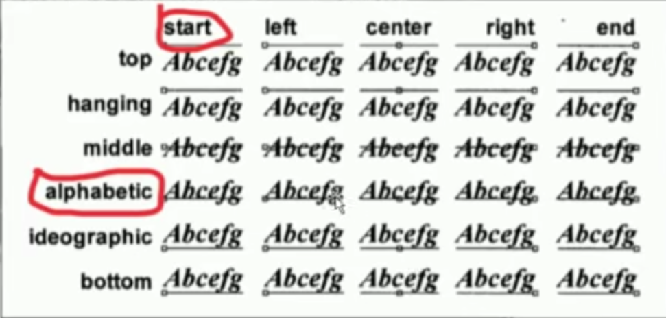
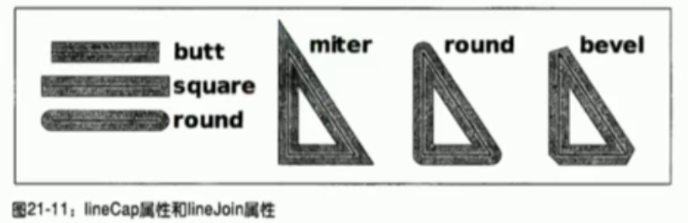
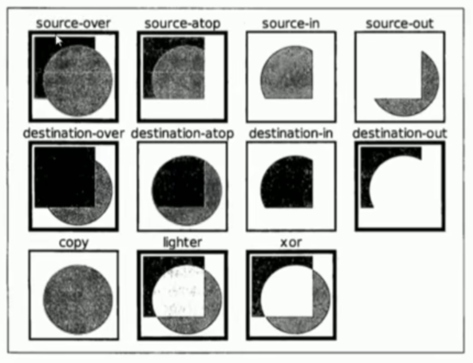

# Canvas

- 应用场景
    - 图表
    - 动画
    - 游戏
    - codepen.io( Canvas动效网址 )

- Canvas发展历史
    - 最早在apple的 safari 1.3 中引入
    - ie9之前的浏览器不支持canvas
    - http://caniuse.com/

- 如何使用Canvas
    - 1. 添加canvas标签
        ```
        <canvas width=500 height=500></canvas>
        ```
    - 2. 获得canvas元素
        ```
        var canvas = document.getElementById('myCanvas');
        ```
    - 3. 获得canvas上下文对象( WebGL绘制3d效果,获取绘图上下文时 --> 'webgl' )
        ```
        var ctx = canvas.getContext('2d');
        ```

- 两个对象
    - 1. 元素对象( Canvas元素 )和上下文对象( 通过getContext('2d')方法获取到的CanvasRenderingContext2D对象 )
    - 2. 元素对象相当于我们的画布,上下文对象相当于画笔,我们接下来的所有操作是基于上下文对象的

- 线段
    - 1. ctx.moveTo(x, y);// 移动到x,y坐标点
    - 2. ctx.lineTo(x, y);// 从当前点绘制直线到x,y点
    - 3. ctx.stroke();    // 描边
    - 4. ctx.lineWidth=20;// 设置线段宽度
    - 5. ctx.closePath(); // 闭合当前路径 和回到起始点的区别
    - 6. ctx.fill();      // 填充

- 重点
    - 1. fill和stroke方法都是作用在当前的所有子路径
    - 2. 完成一条路径后要重新开始另一条路径时必须使用beginPath()方法,beginPath方法开始子路径的一个新的集合

- 矩形
    - 1. ctx.rect(x, y, dx, dy);
    - 2. ctx.fillRect(x, y, dx, dy);
    - 3. ctx.strokeRect(x, y, w, h);
        > 2和3都自带beginPath的效果

- 擦除当前区域
    - 1. ctx.clearRect(x, y, dx, dy);// 从(x, y)到(dx, dy)擦除矩形区域
    - 2. 实现矩形落地动画

- 弧形
    - 1. arc(x, y, r, 起始弧度, 结束弧度, 弧形的方向)
    - 2. 角以弧度计, 0顺时针, 1逆时针

- 圆角
    - ctx.arcTo(x1, y1, x2, y2, r);
    - 绘制的弧线

- 贝塞尔曲线
    - quadraticCurveTo(x1, y1, ex, ey) // 二次贝塞尔曲线
        - x1, y1 // 控制点
        - ex, ey // 结束点
    - bezierCurveTo(x1, y1, x2, y2, ex, ey) // 三次贝塞尔曲线
        - x1, y1, x2, y2 // 控制点
        - ex, ey // 结束点

- 坐标轴转换
    - translate(dx, dy);// 重新映射画布上的(0, 0)位置,即平移整个画布
    - scale(sx, sy);// 缩放当前绘图
    - rotate(Math.PI);// 旋转当前的绘图
    - save() restore();// 保存当前图像的一份拷贝,从栈中弹出存储的图形状态并恢复
    - setTransform(a, b, c, d, e, f);// 先重置,再变换
        - 参数: 水平缩放、水平倾斜、垂直倾斜、垂直缩放、水平移动、垂直移动
    - transform(a, b, c, d, e, f);// 在之前的基础上变换

- 填充图案
    - 1. createPattern(image, "repeat|repeat-x|repeat-y|no-repeat");
    - 2. img元素( Image对象 ),canvas元素,video元素( 有图形的 )
    ```
    var img = document.getElementById('img');
    img.onload = function(){
        ctx.fillStyle = ctx.createPattern(img, 'repeat');
        ctx.fillRect(0, 0, w, h);
    }
    ```

- 渐变
    - 1. createLinearGradient(x1, y1, x2, y2);// 线性渐变,必须在填充渐变的区域里定义渐变,否则没有效果
    - 2. createRadialGradient(x1 ,y1, r1, x2, y2, r2);// 径向渐变
    - 3. bg.addColorStop(p, color);

- 阴影
    - 1. ctx.shadowColor
    - 2. ctx.shadowOffsetX
    - 3. ctx.shadowOffsetY
    - 4. ctx.shadowBlur
        > 注: 这里的偏移量不受坐标系变换的影响

- 文本
    - 1. fillText();
    - 2. strokeText();
    - 3. measureText('hello world');了解
    - 4. textAlign属性和textBaseline属性

    

- 线段样式
    - lineCap
    - lineJoin

    

    - ctx.miterLimit;
        - 当lineJoin是miter时,如果控制倾斜部分的长度超过miterLimit的值,就会变成bevel
            > 注: 实际运算是大于limit*lineWidth/2的值

- 裁剪
    - ctx.clip();// 当前路径外的区域不再绘制
        > 注: 可在clip()前使用save()方法保存,后续通过restore()方法恢复

- 合成( 新像素和原像素的合并方式 )
    - ctx.globalCompositeOperation = 'source-over';
    - 11种值, 默认source-over w3c标准
    - 常用source-over,destination-over,copy

    ;

- 全局透明度
    - ctx.globalAlpha = '0.5';

- 绘制图片
    - 1. ctx.drawImage();// 第一个参数是img(Image, canvas, video), 注: onload
    - 2. 3个参数(x, y);// 起始点坐标
    - 3. 5个参数(x, y, dx, dy);// 起始点坐标以及图片所存区域的宽高
    - 4. 9个参数(x1, y1, dx1, dy1, x2, y2, w2, h2);// 前四个为所绘制目标元素的起始点和宽高,后四个为canvas绘制的起始点和大小

- 将canvas内容导出
    - canvas.toDataURL();
    - 将canvas的内容抽取成一张图片,base64编码格式
        > 注: 同源策略的限制
    - 将canvas的内容放入img元素里

- 获取canvas像素信息
    - ctx.getImageData(x, y, dx, dy);// 需满足同源
    - ctx.createImageData(w, h);// 创建新的空白ImageData对象
    - ctx.putImageData(imgData, x, y);// 将图像数据放回画布上
        > 配合高斯函数实现高斯模糊效果

- 命中检测
    - ctx.isPointInPath(x, y);// 检测是否在区域内
    - ctx.isPointInStoke(x, y);// 检测是否在线上
    - 还可以通过检测当前点的像素值,如果为透明,则该点不在路径上

- canvas是位图,放大失真,大的canvas塞入小相框中,解决canvas放大失真问题