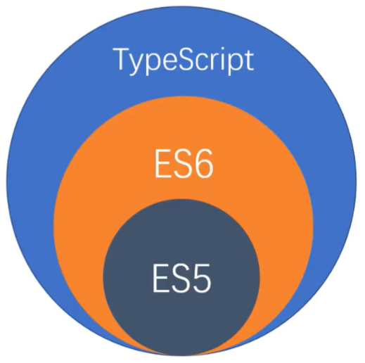

# TS语言的特点

> TypeScript是JS的**超集**, 是一个**可选的**, **静态**的类型系统

- 类型系统
    - 对代码中所有的**标识符**( 变量,函数参数,返回值 )进行**类型检查**
- 静态的
    - **类型检查发生于编译的时候,而不是在运行的时候**
    - TS不参与任何运行时的类型检查( 因为运行的是JS代码 )
    - 无论是浏览器环境,还是Node环境,都无法直接识别TS代码
    - 将TS代码转化成JS代码
        > 使用ts的编译器 ---> tsc

- TS的常识
    - 2012年微软发布
    - Anders Hejlsberg 负责开发TS项目
    - 开源 | 拥抱ES标准
    - 版本 3.4
    - 官网: http://www.typescriptlang.org/
    - 中文网( 个人翻译 ): https://www.tslang.cn/

- TS的**类型检查系统**使得TS可以编写出**完善的面向对象代码**
